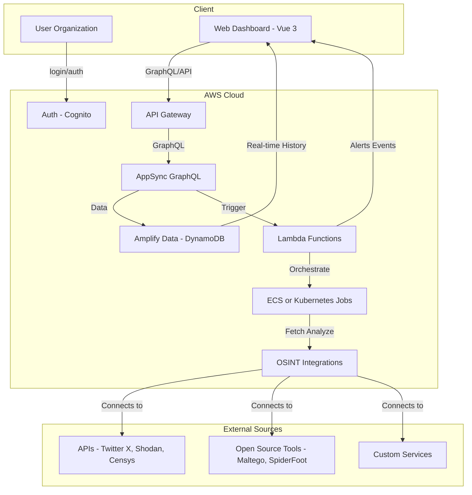

### Organizational Hierarchy: Scopes & Targets

- **Organization**: Can define multiple **Scopes** (projects/campaigns) to separate work for different targets or campaigns.
- **Scope**: Contains one or more **Targets**.
- **Target**: Typed entity (e.g., Website, Domain, Social Footprint, Cloud Provider) with configuration and metadata relevant to its type.

### Storage Architecture
- All blobs and files (reports, findings, wordlists, etc.) will be stored using Amplify Storage APIs.
- Buckets will be scoped per organization to ensure data isolation and security.

### Authorization & Roles
- The application will implement a robust role system for users and organizations.
- Role-based access will be enforced using schema authorization, backed by Cedar for complex data and policy management.
- This enables fine-grained, context-aware permissions for all resources, including data models and storage objects.

### LLM Agent Integration
- The application will leverage LLM agents to:
	- Fine-tune and optimize usage of OSINT tools and APIs based on context and organizational needs.
	- Create and manage contextual wordlists for fuzzing operations, adapting to targets and intelligence requirements.
	- Correlate and enrich data aggregated from tools, services, and APIs, providing actionable insights and reducing noise.

> **Note:** Mermaid diagrams do not support parentheses in node labels. Use numeric encoding (`#40;` for '(' and `#41;` for ')') for compatibility.

## System Architecture Diagram (Mermaid)

### Core Models

### Core Models

#### Organization
| Field           | Type         |
|-----------------|--------------|
| name            | string       |
| contactInfo     | object       |
| settings        | object       |
| apiKeys         | array        |
| users           | array        |
| storageBucket   | string       |

#### Scope
| Field           | Type         |
|-----------------|--------------|
| name            | string       |
| description     | string       |
| organizationId  | string       |
| createdAt       | datetime     |
| updatedAt       | datetime     |
| targets         | array        |

#### Target
| Field           | Type         |
|-----------------|--------------|
| name            | string       |
| type            | enum         |
| config          | object       |
| metadata        | object       |
| scopeId         | string       |
| organizationId  | string       |
| createdAt       | datetime     |
| updatedAt       | datetime     |

#### User
| Field           | Type         |
|-----------------|--------------|
| name            | string       |
| email           | string       |
| roles           | array        |
| organizationId  | string       |
| preferences     | object       |

#### RolePermission (enum)
| Value                |
|----------------------|
| ADMIN                |
| MANAGE_USERS         |
| MANAGE_SCOPES        |
| MANAGE_TARGETS       |
| MANAGE_SOURCES       |
| MANAGE_JOBS          |
| VIEW_FINDINGS        |
| MANAGE_WORDLISTS     |
| MANAGE_REPORTS       |
| VIEW_ALERTS          |
| MANAGE_ALERTS        |
| MANAGE_STORAGE       |
| CUSTOM_POLICY        |

#### Role
| Field           | Type                      |
|-----------------|---------------------------|
| name            | string                    |
| description     | string                    |
| scope           | RoleScope (enum)          |
| permissions     | array of RolePermission   |
| createdAt       | datetime                  |
| updatedAt       | datetime                  |

##### Relationship Models

**OrganizationUserRole**
| Field           | Type                      |
|-----------------|---------------------------|
| userId          | id                        |
| organizationId  | id                        |
| role            | Role (model ref)          |
| createdAt       | datetime                  |
| updatedAt       | datetime                  |

**UserRole**
| Field           | Type                      |
|-----------------|---------------------------|
| userId          | id                        |
| role            | Role (model ref)          |
| createdAt       | datetime                  |
| updatedAt       | datetime                  |

**ScopeUserRole**
| Field           | Type                      |
|-----------------|---------------------------|
| userId          | id                        |
| scopeId         | id                        |
| role            | Role (model ref)          |
| createdAt       | datetime                  |
| updatedAt       | datetime                  |

#### OSINTSource
| Field           | Type         |
|-----------------|--------------|
| type            | enum         |
| config          | object       |
| credentials     | object       |
| enabled         | boolean      |
| organizationId  | string       |

#### MonitoringJob
| Field           | Type         |
|-----------------|--------------|
| jobType         | enum         |
| status          | enum         |
| schedule        | object       |
| sources         | array        |
| parameters      | object       |
| results         | object       |
| organizationId  | string       |
| scopeId         | string       |
| targetId        | string       |

#### LLMAgentContext
| Field           | Type         |
|-----------------|--------------|
| agentType       | enum         |
| contextData     | object       |
| wordlists       | array        |
| organizationId  | string       |
| scopeId         | string       |
| targetId        | string       |
| lastRun         | datetime     |

#### FuzzingWordlist
| Field           | Type         |
|-----------------|--------------|
| name            | string       |
| words           | array        |
| source          | string       |
| usageStats      | object       |
| organizationId  | string       |
| scopeId         | string       |
| targetId        | string       |

#### AggregatedFinding
| Field           | Type         |
|-----------------|--------------|
| title           | string       |
| description     | string       |
| severity        | enum         |
| sources         | array        |
| tags            | array        |
| organizationId  | string       |
| scopeId         | string       |
| targetId        | string       |
| timestamp       | datetime     |
| relatedFiles    | array        |

#### Alert
| Field           | Type         |
|-----------------|--------------|
| type            | enum         |
| message         | string       |
| relatedFindingId| string       |
| status          | enum         |
| organizationId  | string       |
| scopeId         | string       |
| targetId        | string       |
| timestamp       | datetime     |

#### ToolUsageLog
| Field           | Type         |
|-----------------|--------------|
| toolName        | string       |
| parameters      | object       |
| result          | object       |
| agentId         | string       |
| organizationId  | string       |
| scopeId         | string       |
| targetId        | string       |
| timestamp       | datetime     |

#### Report
| Field           | Type         |
|-----------------|--------------|
| title           | string       |
| findings        | array        |
| createdBy       | string       |
| organizationId  | string       |
| scopeId         | string       |
| targetId        | string       |
| createdAt       | datetime     |
| format          | enum         |
| fileRef         | string       |

## System Architecture Diagram (Mermaid)

# Active Context

## Current Goals

- Designing Pulse Hub client-facing app architecture (frontend structure, navigation, data/contracts, role-based access, multi-service dashboards).

## Current Blockers

## Javelin Pulse SigInt Design (2025-08-29)

### Purpose
Client-facing SaaS for real-time OSINT management and monitoring for organizations. Integrates APIs, open source tools, and custom services for intelligence gathering and analysis.

### High-Level Architecture
- **Frontend:** Vue 3 SPA dashboard (follows Javelin conventions)
- **Backend:**
	- AWS Lambda for lightweight, event-driven tasks
	- Containerized jobs (Node.js/TypeScript) in AWS ECS or Kubernetes for heavy, long-running, or stateful processing
	- LLM agent services for tool orchestration, wordlist management, and data correlation
- **Data Layer:** AWS Amplify (DynamoDB, AppSync), real-time updates via subscriptions
- **Auth:** Amazon Cognito, role-based access
- **Integrations:** Pluggable connectors for APIs (Twitter X, Shodan, Censys), open source OSINT tools (Maltego, SpiderFoot), custom enrichment services
- **Monitoring:** Real-time event stream, alerting, historical data, dashboards
- **Admin:** Organization/user management, API key management, usage analytics
- **GraphQL Data Access:** All data access to GraphQL is performed using Amplify Gen2 client libraries, not direct API calls. This ensures type safety, better integration, and maintainability.

### Key Functionality
- Organization onboarding and management
- Source configuration (APIs, tools, custom feeds)
- Real-time monitoring dashboard
- Alerting and notification system
- Historical data search and reporting
- Role-based access control
- Usage analytics and billing (future)

### Backend Rationale
Combines AWS Lambda for scalable, event-driven processing and ECS/Kubernetes for robust orchestration of complex jobs. Leverages AWS managed services for reliability and cost efficiency.