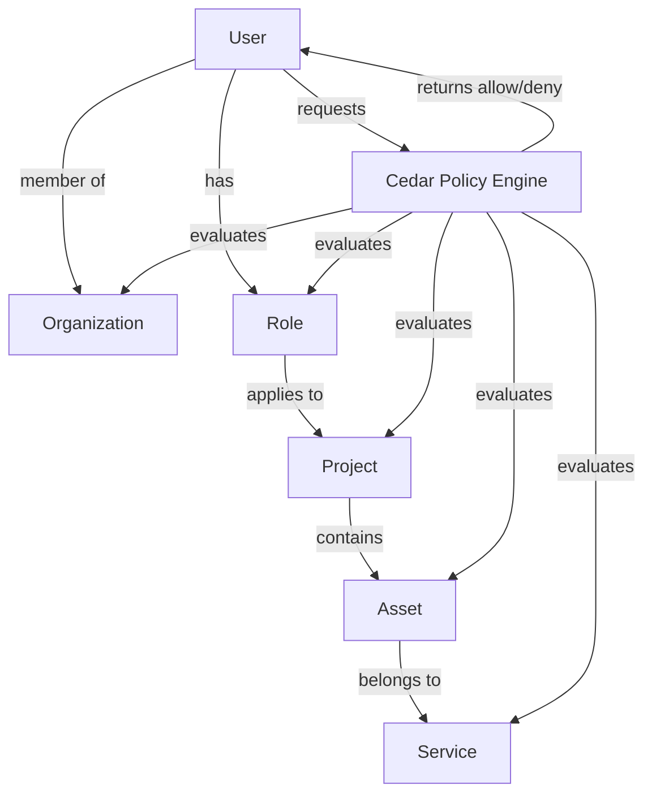

## Authorization Model & Policy Goals

Cedar policies will enforce fine-grained, role-based, and attribute-based access control across organizations, users, projects, and assets. Key goals:

- Only users with appropriate roles can view, modify, or download assets and contracts.
- Organization admins can manage users, projects, and assets within their org.
- Project roles (e.g., manager, contributor, viewer) determine access to project-specific data and actions.
- Asset access is restricted by project, organization, and service type.
- Future services (e.g., vulnerability management) can define custom roles and policies.

## Authorization Policy Diagram

**Example Policy Scenarios:**
- A user with the "Project Manager" role can upload/download assets for their project.
- An organization admin can add/remove users and assign roles.
- A user with "Viewer" role can only view completed reports, not modify or upload.
- Service-specific policies (e.g., vulnerability management) can restrict access to sensitive findings.
# Architecture
