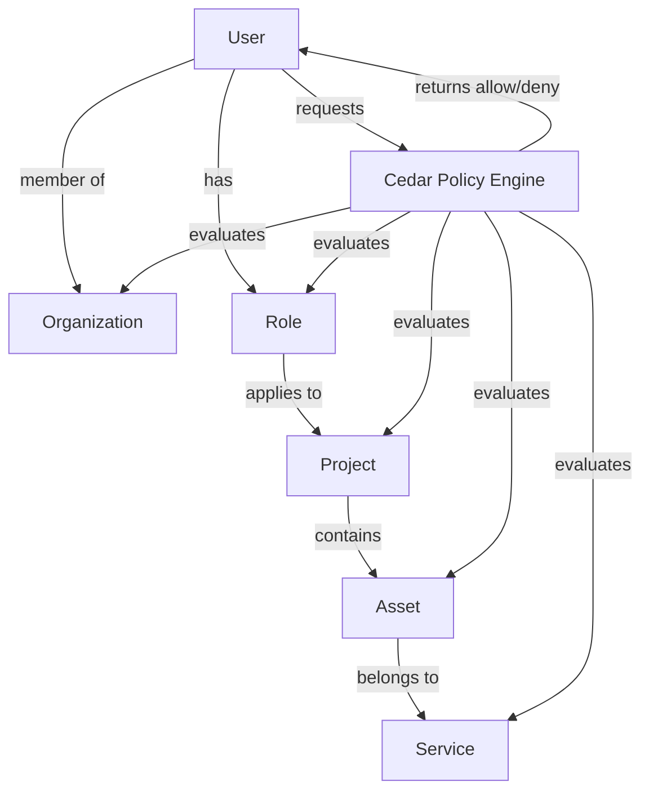
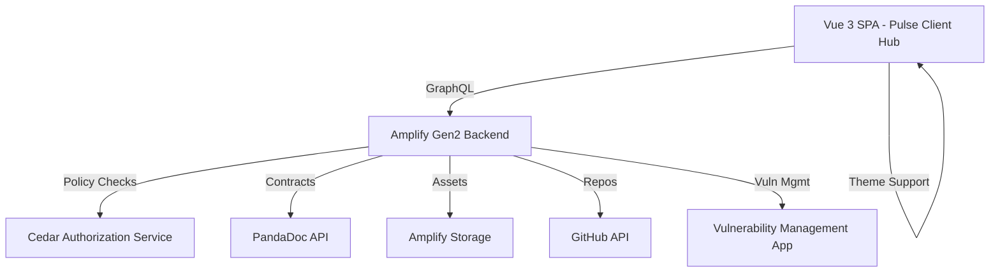
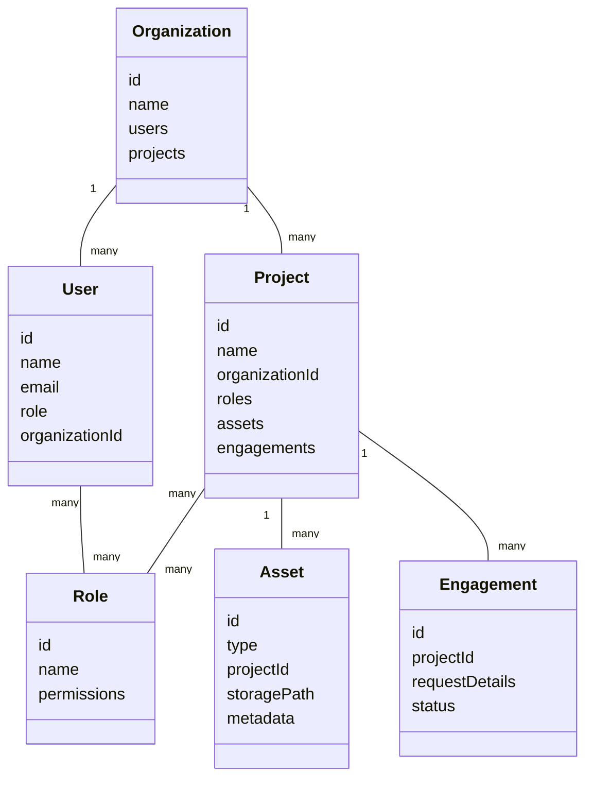

---

## Authorization Model & Policy Goals

Cedar policies will enforce fine-grained, role-based, and attribute-based access control across organizations, users, projects, and assets. Key goals:

- Only users with appropriate roles can view, modify, or download assets and contracts.
- Organization admins can manage users, projects, and assets within their org.
- Project roles (e.g., manager, contributor, viewer) determine access to project-specific data and actions.
- Asset access is restricted by project, organization, and service type.
- Future services (e.g., vulnerability management) can define custom roles and policies.

## Authorization Policy Diagram

**Example Policy Scenarios:**
- A user with the "Project Manager" role can upload/download assets for their project.
- An organization admin can add/remove users and assign roles.
- A user with "Viewer" role can only view completed reports, not modify or upload.
- Service-specific policies (e.g., vulnerability management) can restrict access to sensitive findings.
# Architecture

## High-Level Architecture Diagram

---

## Object Relationship Diagram

---

## UI Wireframes

### Dashboard
- Sidebar: Navigation (Dashboard, Contracts, Projects, Assets, Requests)
- Main: Welcome, recent projects, quick actions

### Contracts Page
- List of contracts (from PandaDoc)
- Download/View buttons
- Filter by project/organization

### Projects Page
- List of projects
- Status, schedule, team members
- Action: Schedule, view details, upload assets

### Assets Page
- List of assets (by project/service)
- Download/upload buttons
- Metadata display

### Engagement Requests
- Form to request new project
- List of previous requests and statuses

### Theme Switcher
- Toggle for dark/light mode in top navigation
